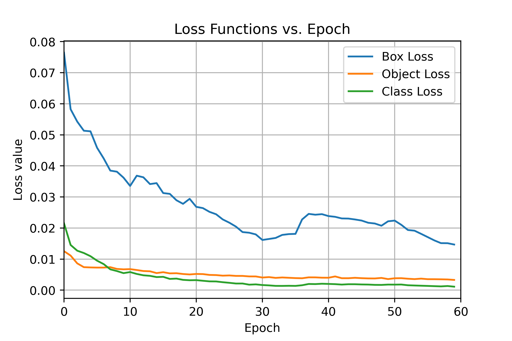
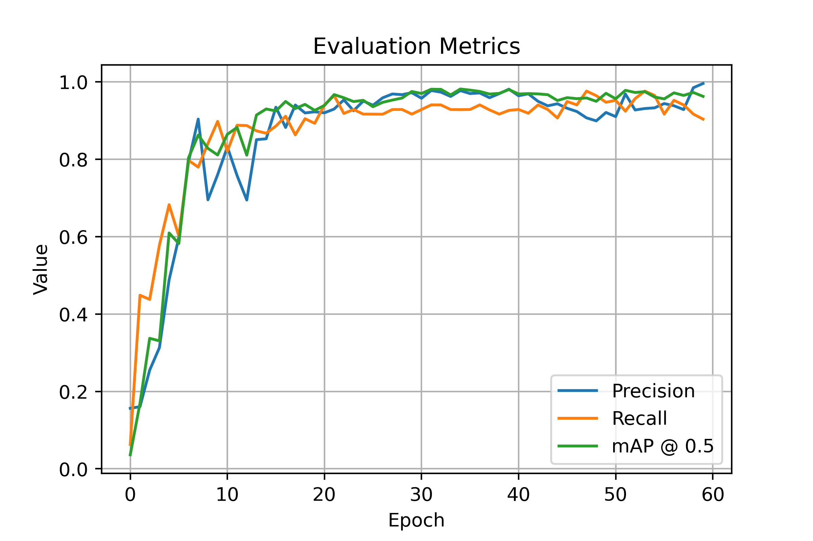
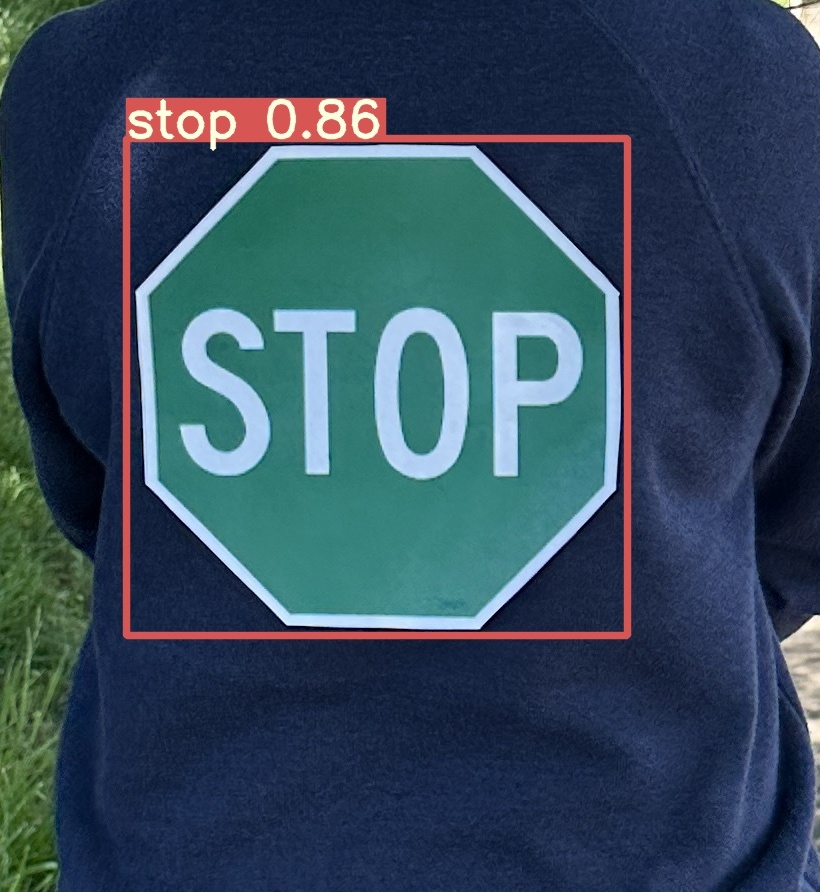

# Effects of Real-Life Traffic Sign Alteration on YOLOv7- an Object Recognition Model

## Course Project for ECE 692: Adversarial AI Methods, Spring 2023, University of Tennessee, Knoxville

<a href="https://drive.google.com/file/d/1W90C9Ur4VZ4mX6qmbYuVF9Nubw8XtyKc/view?usp=sharing"></a>


## Performance 

MS COCO

| Model | Weight | batch 1 fps | batch 32 average time |
| :-- | :-: | :-: | :-: | 
| [**YOLOv7**] | [60_epoch](https://drive.google.com/file/d/1ebVz5GV-b0a8hyH57DJTp2l_8oHiypRT/view?usp=sharing) | 640 | 125 *fps* | 3.9 *ms* |


## Installation

Docker environment (recommended)
<details><summary> <b>Expand</b> </summary>

``` shell
# create the docker container, you can change the share memory size if you have more.
nvidia-docker run --name yolov7 -it -v your_coco_path/:/coco/ -v your_code_path/:/yolov7 --shm-size=64g nvcr.io/nvidia/pytorch:21.08-py3

# apt install required packages
apt update
apt install -y zip htop screen libgl1-mesa-glx

# pip install required packages
pip install seaborn thop

# go to code folder
cd /yolov7
```

</details>

To measure accuracy, download [COCO-annotations for Pycocotools](http://images.cocodataset.org/annotations/annotations_trainval2017.zip) to the `./coco/annotations/instances_val2017.json`

## Training


* Download GTSD dataset  ([Download](https://benchmark.ini.rub.de/gtsrb_news.html).

Single GPU training

``` shell

# train p6 models
python train.py --workers 8 --device 0 --batch-size 32 --data traffic_data.yaml --img 640 640  --weights yolov7.pt --name yolov7 --hyp data/hyp.scratch.p5.yaml
```

<div class="pictures", align="left">
    <a href="./">
        
    </a>
    <a href="./">
        
    </a>
</div>


## Inference

``` shell
python detect.py --weights weights/best.pt --conf 0.25 --img-size 640 --source test_images/ --save-txt --name test --save-conf --device 0
```

<div align="center">
    <a href="./">
        
    </a>
</div>


## Citation

```
@article{ece692_yolo7,
  title={Effects of Real-Life Traffic Sign Alteration on YOLOv7- an Object Recognition Model},
  author={Riya, Farhin Farhad and Hoque, Shahinul and Onim, Md Saif Hassan and Michaud, Edward and Begoli, Edmon},
  journal={----},
  year={-----}
}
```

